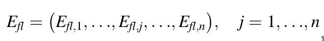

# Socials

  &nbsp
  &nbsp
  &nbsp
  &nbsp
  

# methods-regime
 REGIME Method C++ Code With Object Oriented Principles 

# REGIME Method

    
<b>Introduction</b>

    

    The REGIME method, initially introduced by Hinloopen, Nijkamp, and Rietveld in
1983 [6, 7] is a multiple attribute qualitative method which solves the problem
using the REGIME matrix, and a final ranking of the alternatives is done. In the
final ranking, the weight of attributes, introduced by the decision maker, is
important and can influence the results. This technique is used for ranking the
sawability of ornamental and building stones [8] and evaluation and ranking of
coastal areas [9] due to its features. The REGIME method, used in various fields,
has the following features:
    

    <ul>
      <li>It is one of the compensatory methods;</li>
      <li>The attributes are independent of each other;</li>
      <li>There is no need to convert the qualitative attributes into the quantitative
attributes.</li>
    </ul>
    

    In this method, the matrix of alternatives and attributes is firstly formed based on
the information received from the decision maker as in Eq. (<a href="#1.1">1.1</a>).
    

    <table align="center" border="true">
        
<b>(1.1)</b>X(m,n); i = 1,...,m; j = 1,...,n

        <tr>
            <td><i>r</i>11</td>
            <td>...</td>
            <td><i>r</i>1j</td>
            <td>...</td>
            <td><i>r</i>1n</td>
        </tr>
        <tr>
            <td>...</td>
            <td>...</td>
            <td>...</td>
            <td>...</td>
            <td>...</td>
        </tr>
        <tr>
            <td><i>r</i>i1</td>
            <td>...</td>
            <td><i>r</i>ij</td>
            <td>...</td>
            <td><i>r</i>in</td>
        </tr>
        <tr>
            <td>...</td>
            <td>...</td>
            <td>...</td>
            <td>...</td>
            <td>...</td>
        </tr>
        <tr>
            <td><i>r</i>m1</td>
            <td>...</td>
            <td><i>r</i>mj</td>
            <td>...</td>
            <td><i>r</i>mn</td>
        </tr>
    </table> 

  
Description of REGIME Method

  ## 2.1 Superiority Index
  

  In decision matrix of Eq. (2.1), rij is the element of the decision matrix for <i>i</i>th
alternative in <i>j</i>th attribute. Then, the decision maker provides the weight of
attributes [ w1 ; w2 ; ... ; wn ]:
  

  

  The set of attributes in which alternative A<i>f</i> is at least as good as alternative A<i>l</i> ,
displayed by Ê<i>fl</i> .
 

 ## 2.2 Superiority Identifier
 

 The superiority identifier is calculated by Eq. (<a href="#2.2">2.2</a>).
 

 

  
  </img>
   
  (2.2)
   
 

 
where <i>wj</i> represents the weight of attributes provided by the decision maker.

 ## 2.3 Impacts Matrix
 

 This matrix is derived from ranking the alternatives based on the attributes which
rank the alternatives from decision-matrix information.
 

 ## 2.4 REGIME Matrix
 

  The REGIME matrix is derived from pairwise comparison of alternatives. For example, if two alternatives of <i>A1 , A2 &isin; A</i> are considered, the status of <i>A1 , A2</i> alternatives should be compared to each other in all attributes.
 

 

 For each <i>Cj</i> attribute, the <i>Efl,j</i> identifier is defined for each (<i>Af , Al</i>) alternative as in Eq. (<a href="#2.3">2.3</a>) [6, 9].
 

 

  
   
  (2.3)
 

 

 where (<i>rlj , rfj</i> ) indicates the rank of (<i>Al , Af</i> ) alternative based on the attribute <i>Cj</i> . When two alternatives are examined in all attributes, a vector is defined as in Eq. (<a href="#2.4">2.4</a>) [6, 9].
 

 

  </img> (2.4)
 

 

 The vector of Eq. (<a href="#2.4">2.4</a>) is called the REGIME, and the total matrix is result of the REGIME vectors.
 

 ## 2.5 The Guide Index
 <b>The first technique:</b> The guide index <i>Êjl</i> is introduced as in Eq. (<a href="#2.5">2.5</a>) [9].
 

  </img> (2.5)
 

 <i>Êfl</i> obtains a final ranking of alternatives. 

 The second technique: The value of the best alternative is obtained by the superior identifier <i>Êfl</i>. In fact, the REGIME method is based on the <i>Êfl</i> - <i>Êlf</i> subtract. The positive result of subtract indicates that alternative <i>Af</i> is superior to the alternative <i>Al</i> , and the negative result demonstrates the superiority of alternative <i>Al</i> over alternative <i>Af</i> .

 ## 2.6 The Final Ranking of Alternatives
 According to the two techniques presented in the previous step, the final ranking of alternatives can be determined based on the guide index.

